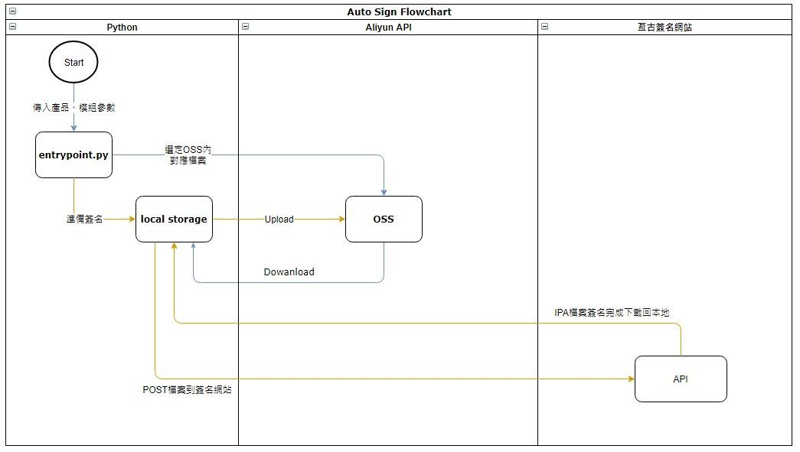

# iOS_automatic_sign

## 說明
* Why  : 在運維工作中有太多雜事需要關心，像是上傳下載這種沒有技術含量的事情應該將其自動化，一方面也可以減少人為操作失誤，另一方面也可以讓團隊成員更專注在其他項目上，這也是這個項目開發的原因。
* What : 將原本流程中的人工下載、上傳簽名網站、最後上傳到雲平台OSS中等等工作自動化。
* Who  : 24H值班人員，當半夜APP出現Bug要緊急修復時，也能一鍵執行Release APP。
* When : 任何時間APP要Release的候時。

## Flowchart

## 使用方法
---
1. 建立目錄
    mkdir -p /opt/scripts/ios_automatic_sign/ios/{unsign,sign}/{ams,booking,game,ars}
2. 修改配置檔 , 配置ipa的儲存路徑
    vim ios_automatic_sign/trevi_tools/aliyun_tools/config.ini
3. 上傳專案到目標機器
4. pip安裝套件
    pip3.6 install -r requirements.txt

## 版本更新資訊
---
* 2019/09/20 刪除download.py
* 2019/09/20 修復OSS上若無檔案則停止動作。
* 2019/09/20 增加ars、bookingars簽名。
* 2019/09/24 因remote 執行 python 腳本的Print無法即時打印 , 改用os.system方法執行linux下的echo命令
* 2019/10/13 亙古網頁改版 , API更換列表如下
    
    | 功能         	| 原始URL                                        	| 修改後URL                                    	|
    |--------------	|------------------------------------------------	|----------------------------------------------	|
    | 登入         	| http://sign.appqyqm.com/Bv1/login/login        	| http://www.tm0479.com/Bv1/login/login        	|
    | 檢查簽名狀態 	| http://sign.appqyqm.com/Bv1/Login/check_status 	| http://www.tm0479.com/Bv1/Login/check_status 	|
    | 或取下載鏈結 	| http://sign.appqyqm.com/Bv1/index/download     	| http://www.tm0479.com/Bv1/index/download     	|

* 2019/10/22 新增進度條。
* 2019/10/31 修正邏輯 , 當亘古上傳檔案失敗後不繼續動作 , 避免影響後續操作。

## 待新增功能
---
* 2019/09/21 增加Retry功能。
* 2019/09/21 新增腳本參數 , 提供重簽名時候的流程(直接從ios-service-package 複製到 lm-app-download )
* 2019/09/21 監控亙古重簽API , 自動觸發重簽
* 2019/10/22 檢查簽名狀態超過10分鐘後自動取消功能。
* 2019/10/22 下載無動作時自動取消功能
